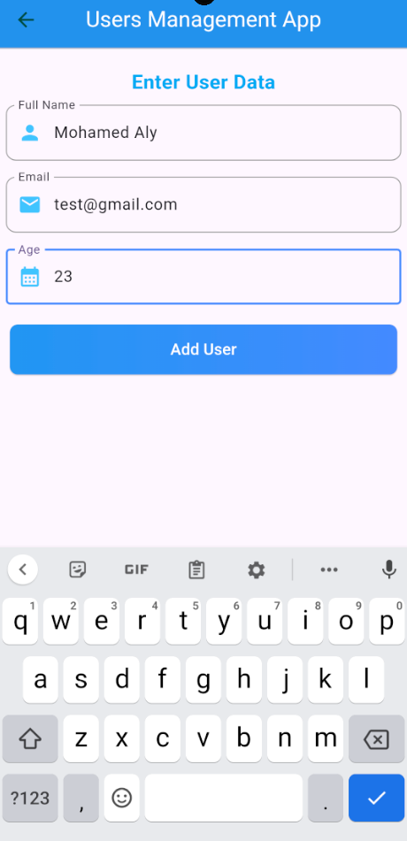

## EMPM: Employment Management App

EMPM is a simple and efficient employment management app that fetches user data from an API endpoint and displays it in a user-friendly interface. The app is built to demonstrate seamless data fetching, error handling, and navigation between pages.

## Features
- Fetches user data dynamically from a JSON API endpoint using Dio.
- Displays a list of users on the home page.
- Provides detailed user information on a separate page (user info page) upon clicking a specific user.
- Robust error handling with try and catch blocks for better user experience.

## Key Functionalities
1. API Integration: 
The app uses Dio for efficient HTTP requests and response handling.
Fetches user data in JSON format from the API.
2. Error Handling: 
Implements robust error handling using try and catch blocks to gracefully manage any network or parsing issues.
3. Navigation: 
The app features smooth navigation between:
The User List Page, displaying a list of all users.
The User Details Page, providing detailed information about a specific user upon selection.

## How It Works
1. **Fetch Users**: The app fetches data from a designated API endpoint.
JSON response is parsed into a User Model for easier data manipulation.

2. **Display Users**: Users are displayed in a scrollable list on the first page.

3. **View Details**: Clicking on a user navigates to a detailed view page showing additional information.

## App screen-shots
### Home page

 
 

### User Info page

 
 
 

# Major Update!
## Added firebase firestore functionality with the old API task

